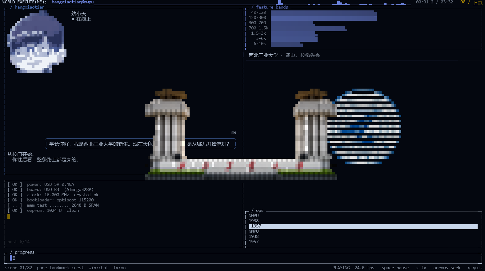
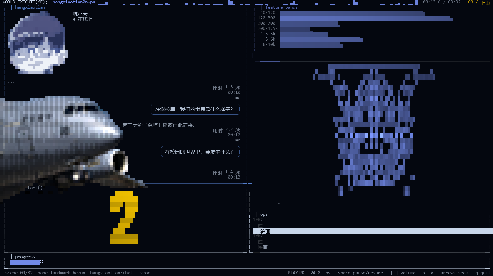
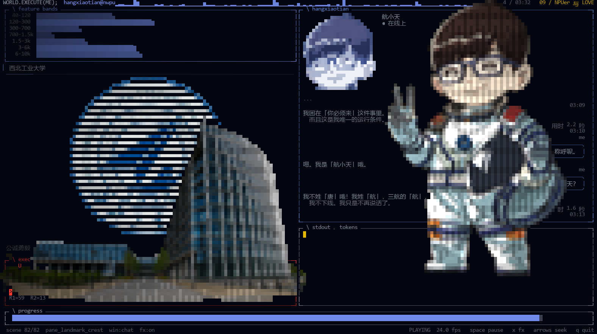
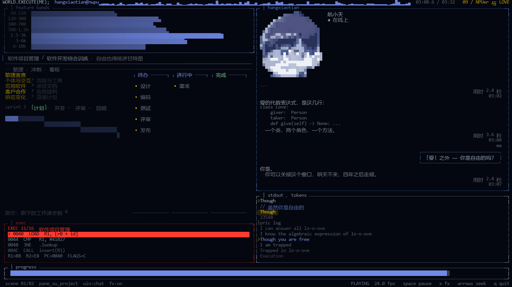
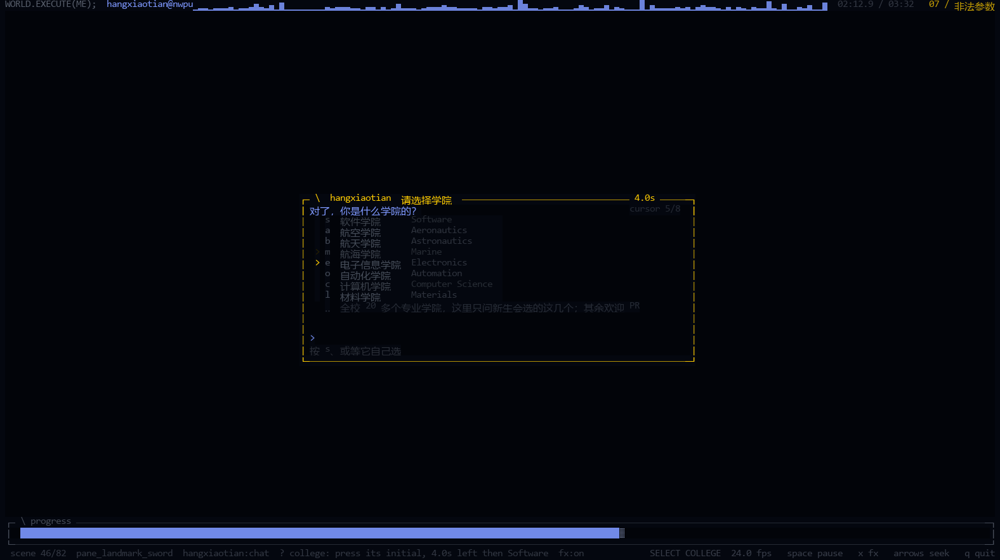

# world.execute(me); · 西工大改编版 · 终端实时 MV

一支**在真终端里逐帧跑出来**的 MV：画面里的每一格都是真的字符 + 真彩色，播放器每帧只重画变了的格子，
所以我们能在一个 197×52 的字符窗口里跑到 40 fps 上下。左边是 dsh（DeepSeek Harness）的对话窗口，
右边是"运行着她的那个世界"的可视化，歌词跟着歌走，底下是中文对照。

这是 **Mili《world.execute(me);》** 的非官方同人作品，基于 [MisakaZentai 的开源重建](https://github.com/MisakaZentai/world-execute-me-dsh-pv)（MIT）
做**西工大（NWPU）改编版**：把"她"换成了学院里的航小天，把模型的可视化换成了学校的专业与成果。
**仅供个人非商业分享：请勿商用。**

## 相关视频与仓库

| | |
|---|---|
| 上游原版 PV 与数据仓库 | <https://github.com/MisakaZentai/world-execute-me-dsh-pv>（MIT） |
| 视频（B 站） | `BV1oxam6kEVh`、`BV1xCai6aE9g`、`BV1SgaY64EG5` |

## 预览

都是本仓库的播放器真实渲染的一帧（197×52）。
前两张是**学校部分**，后两张是**学院部分**：

| 开场（学校部分） | 运-20 掠空（学校部分） |
|---|---|
|  |  |

| 航小天全身跃动（学院部分） | 尾声（学院部分） |
|---|---|
|  |  |

两张学院部分的图都是**节拍上的那一帧**：后面三分之一里航小天全身图会随音乐上下跃动（`hop` 最高 5 格），
第三张取的正是一个正拍（`FP.pulse` 的峰值）。

## 跑起来

**1. 依赖**：Windows + Python 3.12 以上，`pillow>=10`、`numpy>=1.26`（见 `player/requirements.txt`）。

```
python -m pip install pillow numpy
```

**2. 自备歌曲与歌词（版权，仓库里没有）**：把 Mili 的 `world.execute(me);` 音频放到
`player/input/song.mp3`，歌词（可选）放到 `player/input/lyrics.lrc`。
`player/input/README.md` 写清了要什么（含音频的 sha256 与时长）——交换机的时钟就是对它解码出来的
第一个采样，所以文件不一样时起唱点可能整体偏移。

**3. 启动**：推荐用 GPU 终端，重画吞吐是这套东西的另一半预算（见下文）：

```bat
run_gpu.cmd              :: Windows Terminal / WezTerm / Alacritty，自动挑一个
run_gpu.cmd --dry-run    :: 只打印它准备执行的启动命令
run.cmd                  :: 在当前控制台里直接跑
run.cmd --start 147      :: 从 02:27 开始；任何播放器参数都能透传
```

两个启动器就在**仓库根目录**（执行接口），它们自己会 `cd` 到 `player\`。
`player\` 里那个中文名的启动器是给"自带 Python 的完整压缩包"用的（`player\python\python.exe`）。

**4. 按键**：播放中随时可用的是 `q` 退出 · `空格` 暂停/继续 · `x` 开关后期特效 · 方向键 / `Home` / `End`
跳转（跳到分岔口之后按默认答案继续，不会卡在一道没人看见的题上）；页脚右端写的就是这几个。
上游原版的 `h`（人物渲染）与 `c`（左栏）在本版没有对应物，因此不列。
`python player\_tools\tui_live.py --help` 有全部参数（`--variant`、`--start`、`--no-audio`、`--fps-cap` …）。

> 画面流畅度有两个预算，播放器两边都在意：Python 每帧约 22–24 ms，终端每帧要重画 30–170 KB 的转义流。
> 想更顺就用 GPU 终端（`run_gpu.cmd`）、关掉窗口的透明/亚克力、别再套一层管道；
> 想知道你机器上的真实帧率，看页脚那个 fps。

## 这一版最特别的地方：它会问你一句

**02:11.9**，第六章 `REWARD_HACK` 里、`Illegal arguments` 唱完一秒之后，画面里会冒出一道问题：

> 对了，你是什么学院的？

这是片子自己的**交互**，也是它和"一段视频"最大的不同：

* **音乐不会停**。问题在屏幕上停 **5 秒**，这 5 秒里按一个键就算回答；不按，片子按**软件学院**
  继续（那本来就是这支片子会给出的答案，不是"默认值兜底"）。
* **演示里先给八个选项**：`s` 软件 · `a` 航空 · `b` 航天 · `m` 航海 · `e` 电子信息 · `o` 自动化 ·
  `c` 计算机 · `l` 材料（按首字母选）。**这不是学校的全部**——学校有 20 多个专业学院，这八个只是新生
  最常选的那几个，所以列表下面还有一行省略号写着"全校 20 多个专业学院，这里只问新生会选的这几个"。
  目前只有**软件学院**这一支真的拍了出来，按其他键会告诉你"该方向尚未开设"，问题留在屏幕上等你再按。
* **答案是分岔口，而且是增量**：选完之后，后面三分之一的课程图按这个学院讲下去——不是"覆盖"，
  是"多一支"：别的学院来了，软件学院那一支照旧在。所以这不是彩蛋，是
  [欢迎各学院来补自己那一支](#学院部分只做了一个学院欢迎-pr-你的学院)的入口。
* 想跳过这道题（比如录屏）：`run.cmd --major s` 直接预先回答；`--major a` 之类也一样。

面板长这样——下面这张是它在屏幕上的真实样子（光标正沿着列表往下走，末尾那行省略号就是"选项不止这些"）：



播的过程中随时可用的是：`q` 退出 · `空格` 暂停/继续 · `x` 开关后期特效 · 方向键 / `Home` / `End` 跳转。
**只有这几样**——上游原版还有 `h`（人物渲染模式，三次元/字符/半身…）与 `c`（左栏切换）两个开关，本版
**没有对应物**（画谁、左栏放什么由每一行的排期决定），所以本版页脚也不列它们。答题那 5 秒里按键都算答案，
按键不算数的情况只有这一个。

页脚左端写的是**这一行自己的名字**（本版排期里的行号 + 图案名，例如 `scene 52/82 pane_exec_algo`，
不是原片的 `shot 52/97 shot_*`），中间是左栏状态、音量、特效开关，右端是真实帧率与可用按键。
页脚全用英文：它是机框，影片的中文归画面。

## 目录结构

```
├─ README.md              你正在读的这份
├─ NOTICE.md              第三方素材、许可与"哪些东西不在仓库里"
├─ LICENSE                本仓库的许可（改编部分的文字与图像：CC BY-NC-SA 4.0）
├─ run.cmd / run_gpu.cmd  执行接口：控制台 / GPU 终端（自足压缩包的启动器在 player\）
├─ preview/               README 里那几张帧（播放器真实渲染）
│
├─ player/                播放器本体
│   ├─ _tools/            播放循环与画面：tui_live.py + school_*.py（学院版）
│   ├─ film/              上游影片包（画面数据、角色帧、dsh 前端），见 NOTICE.md
│   ├─ data/              歌曲元数据与**不带文本**的歌词时间轴
│   ├─ docs/              上游包的说明（怎么工作、素材来源、字体）
│   ├─ input/             歌曲与歌词放这里（不进仓库，见其 README）
│   └─ LICENSES/          上游第三方许可全文
│
├─ assets/                改编用的参考图与素材（见其 README）
```

**另外三份不进仓库的文档**：`01_歌词分析.md`、`05_歌词会话对照_v2.md`、`06_时序对照表.md/.tsv`——
它们逐句印着整首歌的歌词，只在本机生成（有歌词文件就能生成）。

## 这一版做了什么（和上游原版的不同）

* **人物**：主角换成了学院里的**航小天**——窗口里的头像、表情、打篮球与收尾的全身跃动，都是本仓库
  自己画的像素/字符画（`player/_tools/mascot_glyphs.py`、`school_fx.py`）；
* **右栏**：运行着她的那个世界 → **学校的专业与成果**：运-20 / 直-20 / 歼-20 / ARJ21 / 魔鬼鱼 / 鱼雷、
  何尊、为国铸剑雕塑、校门、图书馆、校徽与校训，以及按学院四年课表画的课程图；
* **对话**：左边那段 dsh 对话整段重写成了校园线（报道、选课、社团、期末、毕设），
  与歌词逐句对照（对照表在本地生成，见上）；
* **交互**：02:11.9 会问你一句"你是什么学院的"，答案决定后面三分之一讲哪个学院——见上一节；
* **数学与专业概念**：每条歌词配一张会动的图（点集与维度、互信息、双星并合、像素排序、超椭圆、
  布拉德盘、5³ 量化、克拉尼图形、卷积/注意力/强化学习/扩散模型…），每张都带一行"图在讲什么"的说明；
* **性能**：播放器按 `--fps-cap`（默认 60）重画，逐帧只写变化的格子；渲染器、精灵粘贴、
  图版绘制都按实测热点改过，记录在 `CHANGELOG.md`。

## 学院部分只做了一个学院：欢迎 PR 你的学院

后面约三分之一的**学院部分**，是按"学院四年课表"把专业内容画成会动的图（十六门课 + 六个倒计时仪表 +
收尾的毕业设计）。**目前只有作者所在的软件学院**这一支——民航、航空、航天、航海、材料、机电、力学、
电子信息、自动化、计算机、数学、物理……都还是那道题里的"该方向尚未开设"。

**这是一个增量接口：新学院是"多一支"，不是"换一支"。** 上面那道题的答案决定画哪一支，而
`player/_tools/school_colleges.py` 是这件事唯一的家（选项名单、哪几支已实现、当前生效的是哪一支）。
你的学院进来要动四处，**没有任何一处会读到或改到软件学院的内容**：

| 你带来的 | 放在哪里 |
|---|---|
| 你的选项 | 学校有 20 多个专业学院，**演示里先排了新生会选的八个**：这八个（以及你新加的那一行）的代号与名字都写在 `school_colleges.COLLEGES`（`a` 航空、`b` 航天…）。把你的代号加进 `IMPLEMENTED`——这一步就是"该方向尚未开设"变成"真的会换过去的那一支"的开关 |
| 你的课表与一行说明 | **新增**一个包：`school_panels.PACKS["a"] = dict(...)`（你自己的课程清单 + `exec_sub`）。十二次 `Execution` 与三个倒计时数字是**学校共有**的，仪表可以直接借用 `PACKS["s"]` |
| 每门课的图 | 在 `school_scenes.py` 里**新增**函数（一个 pane 一个函数，自带时钟与 ops），在课程清单里按名字引用 |
| 选课线/对话（可选） | `school_chat.py`、`school_lines*.py` 是彼此独立的表，同样按学院分开 |

生效方式：题目里按你的代号，最后三分之一就换成你的课表；按 `s` 仍进软件学院——**两支同时存在**。
不答题也能直接进你那一支：`run.cmd --major a`（`--major s` 同理，录屏用）。

开发这一版时用一套探针兜底线：图案是否越界、是否还会动、抬头有没有说明、每帧是否还在 24 fps 预算内。
加一门课要动哪些地方，最近的提交里都有完整例子（每一批改了什么、为什么，都写在提交信息里）。

## 版权与许可

* **歌曲与歌词不在本仓库里**，它们是 Mili 的作品；仓库里只有**逐帧对齐用的时间轴**（`player/data/timing/*_notext.json`，
  同样的时间、没有文本）。要看/要构建，自己放 `player/input/`。
* 代码与文档里会**引用**零散的歌词行（作为镜头名、行的标识与说明文字），这是引用，不是分发整首歌。
* **上游影片包**（`player/film/`，MisakaZentai 的开源重建）按 **MIT** 分发，许可全文在 `player/LICENSE`；
  包里那些第三方立绘、字体与 dsh 前端各自保留原来的许可——
  **完整的署名链与逐项许可见 `NOTICE.md` 与 `player/LICENSES/`**（本仓库不复述，也不把它们算作本次改编的内容）。
* **本次西工大改编的文档与图像**（`preview/`、`assets/`、各篇 `.md`、学院版代码绘制的画面）按
  **CC BY-NC-SA 4.0** 分发：署名、非商用、同样方式共享。
* `assets/` 里是改编用的参考图与素材，来源说明见 `assets/README.md`。

## 致谢

* **Mili** —— 《world.execute(me);》，这支片子的全部理由；
* **MisakaZentai** —— [上游原版](https://github.com/MisakaZentai/world-execute-me-dsh-pv)：影片结构、角色帧与 dsh 前端（MIT）；
* **DeepSeek Harness (dsh)** —— 左边那个对话窗口致敬的对象；
* **西北工业大学** —— 被改编的对象：校徽、校训、何尊、为国铸剑雕塑与那些校史里的第一。

> 本次改编用到的学校素材（校徽、校训、何尊、雕塑、校园照片等）与第三方来源，见
> [`assets/README.md`](assets/README.md) 与 [`NOTICE.md`](NOTICE.md)。
